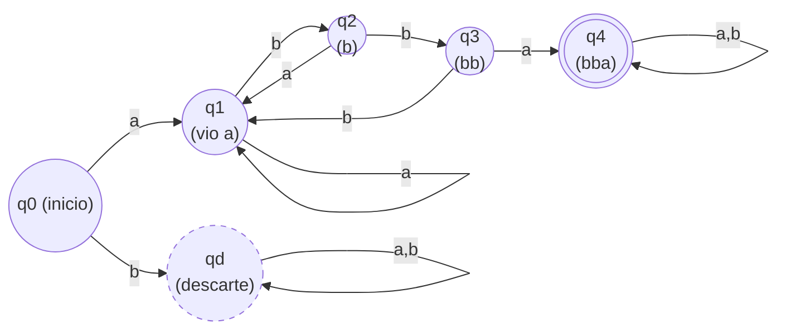

>[!warning] ¡Cuidado!
>Estos ejercicios no han sido corregidos por nadie. Si encuentras algún error no dudes en comunicármelo: contacto.wiki@danicallero.es

# 1. Lógica

>Dados los predicados: $\newline$
>$E(x):x\text{ es un estudiante.}\newline$
>$P(x):x \text{ es un profesor}.\newline$
>$M(x,y):x \text{ envía un correo a}\;y$
>
>Empareja cada enunciado con su negación:

1. Todos los estudiantes envían un correo a algún profesor.
2. Ningún estudiante recibe un correo de todos los profesores.
3. Hay profesores que no envían correos a ningún estudiante.
4. Hay profesores que no reciben correos de ningún estudiante.
5. Algún profesor no recibe un correo de todos los estudiantes.

- a) $\forall z\;[P(z)\rightarrow (\exists y\;E(y) \land \neg M(z,y))]$
- b) $\forall z\;[P(z)\rightarrow(\exists y\;E(y)\land M(z,y))]$
- c) $\exists z\;[P(z)\land(\forall y\;E(y)\rightarrow \neg M(y,z))]$
- d) $\exists z\;[E(z) \land \forall y\;(P(y)\rightarrow \neg M(y,z))]$
- e) $\exists y\;[E(y)\land\forall z\;(P(z)\rightarrow M(z,y))]$

##### Enunciado 1:
>[!abstract] 1: Escritura lógica y simplificación a disyunciones y conjunciones
>$\forall x\,[E(x)\rightarrow \exists y\,(P(y)\land M(x,y))]\equiv \forall x\,[\neg E(x)\lor \exists y\,(P(y)\land M(x,y))]$ 

>[!abstract] 2: Negación
>$\exists x\,[E(x)\land \forall y\,(\neg P(y)\lor \neg M(x,y))] \equiv \exists x\,[E(x)\land \forall y\,(P(y)\rightarrow \neg M(x,y))]$
>
>**(opción d)**.

##### Enunciado 2:
>[!abstract] 1: Escritura lógica y simplificación a disyunciones y conjunciones
>$\forall x\,[E(x)\rightarrow \exists y\,(P(y)\land \neg M(y,x))]\equiv \forall x\,[\neg E(x)\lor \exists y\,(P(y)\land \neg M(y,x))]$

>[!abstract] 2: Negación
>$\exists x\,[E(x)\land \forall y\,(\neg P(y)\lor M(y,x))]\equiv \exists x\,[E(x)\land \forall y\,(P(y)\rightarrow M(y,x))]$
>
>**(opción e)**.

##### Enunciado 3:
>[!abstract] 1: Escritura lógica y simplificación a disyunciones y conjunciones
>$\exists z\,[P(z)\land \forall y\,(E(y)\rightarrow \neg M(z,y))]\equiv \exists z\,[P(z)\land \forall y\,(\neg E(y)\lor \neg M(z,y))]$

>[!abstract] 2: Negación
>$\forall z\,[\neg P(z)\lor \exists y\,(E(y)\land M(z,y))]\equiv \forall z\,[P(z)\rightarrow \exists y\,(E(y)\land M(z,y))]$
>
>**(opción b)**.

##### Enunciado 4:
>[!abstract] 1: Escritura lógica y simplificación a disyunciones y conjunciones
>$\exists z\,[P(z)\land \forall y\,(E(y)\rightarrow \neg M(y,z))]\equiv \exists z\,[P(z)\land \forall y\,(\neg E(y)\lor \neg M(y,z))]$

>[!abstract] 2: Negación
>$\forall z\,[\neg P(z)\lor \exists y\,(E(y)\land M(y,z))]\equiv \forall z\,[P(z)\rightarrow \exists y\,(E(y)\land M(y,z))]$
>
>**(opción a)**.

##### Enunciado 5:
>[!abstract] 1: Escritura lógica y simplificación a disyunciones y conjunciones
>$\exists z\,[P(z)\land \exists y\,(E(y)\land \neg M(y,z))]\equiv \exists z\,[P(z)\land \exists y\,(E(y)\land \neg M(y,z))]$

>[!abstract] 2: Negación
>$\forall z\,[\neg P(z)\lor \forall y\,(\neg E(y)\lor M(y,z))]\equiv \forall z\,[P(z)\rightarrow \forall y\,(E(y)\rightarrow M(y,z))]$
>
>**(opción c)**.

# 2. Combinatoria

>La tienda de la UDC vende camisetas con el logo de la UDC. Dispone de camisetas en las tallas S,M,L y XL. Las camisetas de la misma talla son idénticas. Si queremos comprar en total 18 camisetas:

>[!abstract] ¿Cuántos pedidos distintos podemos hacer si queremos comprar al menos 3 camisetas de la talla S?

Sabemos que queremos comprar 18 camisetas de 4 tallas distintas, pero desconocemos la cantidad de cada una de ellas:
$$s + m + l + xl = 18$$
También sabemos que **al menos** tres de ellas serán de la talla $s$, por lo que debemos averiguar de cuantas maneras podemos repartir las restantes entre los cuatro grupos (tallas), sabiendo que podemos pedirle al proveedor una cantidad infinita de camisetas de una misma talla (admite repetición): $CR(4,15)$
$$
CR(4, 15) = \binom{4 + 15 - 1}{4 -1} = \binom{18}{3} = C(18, 3)
$$
$$
C(18, 3) = \frac{18!}{3!\cdot15!} = \frac{16 \cdot 17 \cdot 18}{6} = 3 \cdot 16 \cdot 17 = \boxed{816}
$$

>[!ojo] ¡Ojo!
>Esto es así porque son **al menos** 3 tallas $s$, si fuesen exactas sería $CR(3, 15)$ 

>[!abstract] ¿Cuántos pedidos distintos se pueden realizar si queremos comprar, al menos 3 de talla S, y como máximo, 4 camisetas de cada una de las otras 3 tallas?

Del apartado anterior, obtenemos $CR(18, 3) = 816$ sin acotar, pero debemos restringir las tallas a un máximo de 4.

Para resolver este apartado utilizamos el **principio de inclusión-exclusión**, que permite contar los elementos que cumplen varias restricciones restando los casos que las incumplen y corrigiendo las sobre-restas.

Primero fijamos las 3 camisetas obligatorias de talla S y definimos:
$$
s' = s - 3 \ge 0
$$
Con ello, la ecuación queda:
$$
s' + m + l + xl = 15
$$

Si no hubiese ninguna restricción superior, el número total de pedidos sería:
$$
CR(18, 3) = 816
$$

Ahora imponemos las restricciones:
$$
m \le 4,\quad l \le 4,\quad xl \le 4
$$

>Principio de inclusión-exclusión

Contamos primero **todas** las soluciones y después eliminamos las que incumplen las restricciones.

Definimos los conjuntos:
- $A_m$: pedidos con $m \ge 5$
- $A_l$: pedidos con $l \ge 5$
- $A_{xl}$: pedidos con $xl \ge 5$

Queremos contar:
$$
|U \setminus (A_m \cup A_l \cup A_{xl})|
$$

>Restamos los casos que incumplen una restricción

Si $m \ge 5$, definimos:
$$
m' = m - 5 \ge 0
$$
y queda:
$$
s' + m' + l + xl = 10
$$
El número de soluciones es:
$$
CR(4,10) = \binom{13}{3} = 286
$$

Este razonamiento es idéntico para $l \ge 5$ y $xl \ge 5$, por lo que restamos:
$$
|A_m| + |A_l| + |A_{xl}| = 3 \cdot 286 = 858
$$

>Sumamos los casos restados dos veces

Ahora contamos los pedidos en los que **dos tallas** superan el máximo. Por ejemplo, si $m \ge 5$ y $l \ge 5$:
$$
m' = m - 5,\quad l' = l - 5
$$
y la ecuación queda:
$$
s' + m' + l' + xl = 5
$$
El número de soluciones es:
$$
CR(4,5) = \binom{8}{3} = 56
$$

Hay $\binom{3}{2} = 3$ pares posibles de tallas, así que sumamos:
$$
|A_m \cap A_l| + |A_m \cap A_{xl}| + |A_l \cap A_{xl}| = 3 \cdot 56 = 168
$$

No es posible que las tres tallas $m, l, xl$ sean mayores o iguales que 5, ya que eso requeriría al menos 15 camisetas solo para ellas.

>[!remark] Resultado final
>
>Aplicando inclusión-exclusión:
>$$
>816 - 858 + 168 = \boxed{126}
>$$
>
>Este es el número de pedidos distintos que cumplen todas las condiciones.

# 3. Combinatoria

> Un circuito eléctrico tiene 10 conmutadores, cada uno de los cuales puede estar en una de las tres posiciones: 0, 1, 2. Una luz de alarma se enciende cuando hay exactamente 4 conmutadores cualesquiera en posición 0. ¿Cuántos estados llevan a que se encienda la luz de alarma?

En primer lugar, se escogen los 4 conmutadores que están en posición 0. Como nos da igual cuales de ellos se escojan, y un conmutador no se puede escoger dos veces: $C(10,4)$
$$
C(10,4) = \frac{10!}{4! \cdot 6!} = \frac{7 \cdot 8 \cdot 9 \cdot 10}{2 \cdot 3 \cdot 4} = 7 \cdot 3 \cdot 10 = 210
$$

Luego, el resto de conmutadores $(6)$, son distinguibles (importa para el estado del conjunto de conmutadores qué conmutador toma qué posición), tienen dos opciones (la 0 ya no la pueden tomar): $VR(2,6)$ (hay 6 posiciones que pueden tomar cualquiera de 2 valores).

Luego, por conteo:
$$
\begin{align}
Total &= C(10,4) \cdot 2^6 \\
Total &= 210 \cdot 64 \\
Total &= 13.440
\end{align}
$$
# 4. Grafos

> Sea G un grafo de 9 vértices y 11 aristas. G tiene 8 vértices de grado p y uno de grado q.

>[!abstract] Calcula $p$ y $q$ sabiendo que $G$ es euleriano

Como es euleriano, sabemos que $p$ y $q$ son pares, y por el lema del apretón de manos sabemos que:
$$
\begin{align}
\sum(\deg(v)) &= 2 |E|\\
8 \cdot p + q &= 2 \cdot 11 \\
\end{align}
$$
$$\boxed{8p + q = 22}$$

Probamos con $p = 2$ (es la mayor cantidad par de vértices de grado 8 que admite un grafo de 11 aristas):
$$
\begin{align}
16 + q &= 22 \\
q &= 6
\end{align}
$$

Entonces: $\boxed{q = 6 \;\text{y}\; p = 2}$

# 5. Grafos

> Sea T un árbol con un vértice raíz que tiene grado 2, y los demás vértices que no son hojas tienen grado 3

>[!abstract] Si $T$ tiene 43 hojas, ¿cuántos vértices tiene en total?

Por el lema del apretón de manos, sabemos que para cualquier grafo:  $\sum(\deg(v)) = 2 |E|$, y por ser un árbol, sabemos que $|E|=|V|-1$.

Por lo tanto, siendo $I$: vértices internos, $H$: hojas, y $R$: raíz
$$
\begin{align}
|E| &= H + 1 + I - 1 \\
    &= H + I \\
\end{align}
$$
Además:
$$
\begin{align}
\sum \deg(v) &= 2|E| \\
H + 3I + 2 &= 2|E|
\end{align}
$$
Entonces:
$$
\begin{align}
H + 3I + 2 &= 2(H + I) \\
H + 3I + 2 &= 2H + 2I \\
I + 2       &= H
\end{align}
$$

Para cualquier árbol con estas características: $\boxed{H = I + 2}$

Si tenemos que $H = 43$, $43 = I + 2 \implies \boxed{I = 41}$

Como $I = 41$, $H = 43$, $R = 1$, la cantidad de vértices en total que tiene es: $|V| = I + H + R = \boxed{85}$

>[!abstract] Si $T$ tiene 48 vértices internos, ¿cuántas hojas tiene?

En el anterior apartado, ya se demostró que para cualquier árbol con estas características: $\boxed{H = I + 2}$. Entonces, si $T$ tiene 48 vértices internos, y entendemos que uno de ellos es la raíz, $I = 47$.
$$H = 47 + 2 = \boxed{49}$$
# 6. Inducción

>Demuestra por inducción que $7^{n+5} - 1$ es múltiplo de $6$ para cualquier $n \in \mathbb{N}$.

Queremos probar que, para todo $n \in \mathbb{N}$, se cumple:
$$
6 \mid (7^{n+5} - 1)
$$

**Paso base:

Tomamos $n = 0$. Entonces:
$$
7^{0+5} - 1 = 7^5 - 1 = 16806
$$
y claramente:
$$
16806 = 6 \cdot 2801
$$
Por lo tanto, el enunciado se cumple para $n = 0$.

**Hipótesis de inducción:**

Suponemos que para algún $n \in \mathbb{N}$ se cumple que:
$$
7^{n+5} - 1 = 6k
$$
para cierto $k \in \mathbb{Z}$.

**Paso inductivo:**

Queremos demostrar que:
$$
7^{(n+1)+5} - 1 = 7^{n+6} - 1
$$
es múltiplo de $6$.

Para poder usar la hipótesis de inducción, necesitamos que aparezca el término $7^{n+5} - 1$. Para ello, escribimos $7^{n+6}$ como:
$$
7^{n+6} = 7 \cdot 7^{n+5}
$$

Calculamos:
$$
\begin{align}
7^{n+6} - 1 &= 7 \cdot 7^{n+5} - 1 \\
            &= 7(7^{n+5} - 1) + 6
\end{align}
$$

Por la hipótesis de inducción, $7^{n+5} - 1 = 6k$, luego:
$$
7(7^{n+5} - 1) + 6 = 7 \cdot 6k + 6 = 6(7k + 1)
$$

Por tanto, $7^{n+6} - 1$ es múltiplo de $6$.

**Conclusión:**

El enunciado es cierto para $n = 0$ y que, si se cumple para $n$, entonces también se cumple para $n+1$.

Por el principio de inducción matemática, se concluye que:
$$
\boxed{7^{n+5} - 1 \text{ es múltiplo de } 6 \text{ para todo } n \in \mathbb{N}}
$$

# 7. Autómatas

> Diseña un autómata que empiece por a y que contenga, al menos una vez, la cadena bba.

[Descargar](images/Examen_MD_2024-2025.pdf) este examen en PDF.