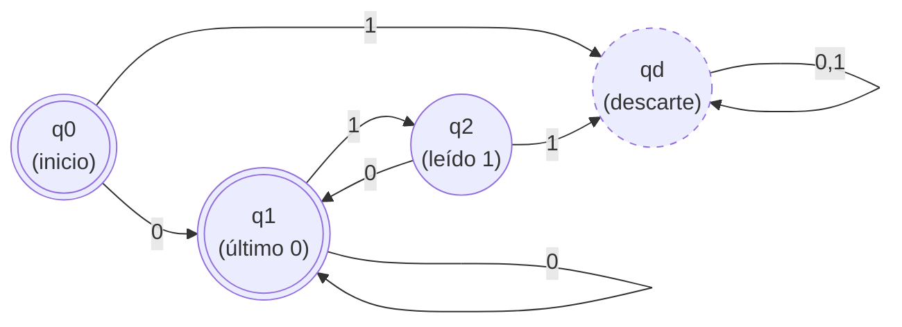
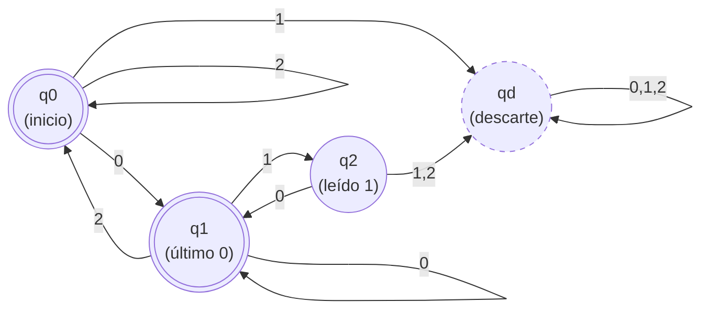

# 1. Lógica

>Demuestra con un árbol semántico el argumento:$\newline$

$$\{(\exists x\;\neg T(x))\rightarrow(\forall x\;\neg R(x)),\exists x\; R(x)\}\models\exists x\;T(x)$$

![[images/MD_enero2022_1.jpeg]]

---
# 2. Álgebras de Boole

>Sea A un álgebra de Boole:

>[!abstract] i)
>Demuestra que, para cualquier par de elementos $a,b\in A$, se verifica:
>$$\overline{a}+b=b+\overline{(\overline{b}a+ba)}.$$

Para verificar la igualdad, comprobamos que $\overline{a}=\overline{(\overline{b}a+ba)}$:
$$
\begin{align}
\overline{a}&=\overline{(\overline{b}a+ba)}\\
&=\overline{(\overline{b}+b)a}\\
&=\overline{1a}\\
&=\overline{a} \;\checkmark
\end{align}
$$
Se verifica la igualdad, por lo tanto cualquier par $a,b$ verifican $\overline{a}+b=b+\overline{(\overline{b}a+ba)}.$

>[!abstract] ii)
>Dado un $b\in A$, demuestra que:
>
>$$
>b=0\Leftrightarrow b\overline{a}+\overline{b}a=a \;\textbf{para todo}\; a\in A
>$$

Para demostrar una doble implicación, demostraremos cada implicación independientemente:

$$
\begin{align}
\text{Por un lado}:\\
b=0\Rightarrow b\overline{a}+\overline{b}a&=a\\
0\overline{a}+\overline{0}a&=a\\
0+1a&=a\\
a&=a\;\checkmark
\end{align}
$$
$$
\begin{align}
\text{Por otro lado}:\\
b=0\Leftarrow b\overline{a}+\overline{b}a&=a\\
b\overline{0}+\overline{b}0&=0\\
b+0&=0\\
b&=0\;\checkmark
\end{align}
$$
---
# 3. Aplicaciones

>Sea $g: \mathbb{Q} \times \mathbb{Q} \to \mathbb{Q} \times \mathbb{Q}, \quad \text{definida por}:\; g(a,b) = (a-b, a+b)$

>[!abstract] i.
>¿La aplicación $g$ es inyectiva? $\newline$
>Justifica tu respuesta.

Para que una aplicación sea inyectiva, se da que para elementos distintos del dominio, se cumple que nunca tienen la misma imagen. O dicho de otra forma, si dos elementos del dominio tienen la misma imagen, necesariamente son el mismo elemento.

Entonces,$\newline$
Supongamos que $g(a,b)=g(c,d)$, necesariamente se tiene que demostrar que $a=c \text{ y } b=d$.

Aplicado a $g:\newline$
$$\left. a-b=c-d \atop a+b=c+d \right\}\implies \left. 2a=2c \implies a=c \;\checkmark \atop 2b=2d\implies b=d\;\checkmark\right.$$
La aplicación es inyectiva.

>[!abstract] ii.
>¿La aplicación $g$ es sobreyectiva? $\newline$
>Justifica tu respuesta.

Para que una aplicación sea sobreyectiva, todo elemento del codominio debe ser imagen de algún elemento del dominio.
$$
\forall (x,y) \in \mathbb{Q} \times \mathbb{Q}, \; \exists (a,b) \in \mathbb{Q} \times \mathbb{Q} \mid g(a,b)=(x,y)
$$
Tomaremos $(x,y)$ elemento cualquiera de $\mathbb{Q} \times \mathbb{Q}$. Para demostrar la sobreyectividad, debe cumplirse:
$$
\left. a-b=x\atop a+b=y \right\} 
$$
Despejando las ecuaciones, obtenemos que:
$$
\left. 2a=x+y \atop 2b=x-y\right\} \implies \left. a=\frac{{x+y}}{2}\atop b=\frac{{x-y}}{2}\right.
$$
Como tratamos con números racionales, se verifica que es sobreyectiva porque $(x,y)=g(\frac{x+y}{2},\frac{x-y}{2}) \in \mathrm{Im}\;g$

>[!abstract] iii.
>¿La aplicación $g$ admite inversa? $\newline$
>Justifica tu respuesta.

Una aplicación admite inversa si, y solo si, es tanto inyectiva como sobreyectiva. Es decir, si es biyectiva.

En el apartado i. vimos que $g$ es inyectiva, y en ii. vimos que también es sobreyectiva. Por tanto, la aplicación $g$ es biyectiva y admite inversa.

---
# 4. Relaciones

> En el conjunto $A=\{(1,1),(2,1),(3,1),(1,2),(2,2),(3,2),(1,3),(2,3),(3,3),(4,2),(4,3)\}$ se considera la relación de orden:
> $$(a,b)\preceq(c,d)\iff(a\leq c)\land(b\leq d)$$

>[!abstract] i)
>Representa el diagrama de hasse para $(A,\preceq).$

![[images/MD_enero22_4_1.jpeg|240]]

>[!abstract] ii)
>Halla los elementos distinguidos de $B=\{(1,1),(1,2),(2,1)\}:$

| - maximales de $B:$ $\quad\{(2,1),(1,2)\}$                                       | - máximo de $B:$ no existe         |
| -------------------------------------------------------------------------------- | ---------------------------------- |
| - minimales de $B:$ $\quad\{(1,1)\}$                                             | - mínimo de $B:$ $\quad\{(1,1)\}$  |
| - cotas inferiores de $B$ en $A:$ $\quad\{(1,1)\}$                               | - ínfimo de $B:$ $\quad\{(1,1)\}$  |
| - cotas superiores de $B$ en $A:$ $\quad\{(2,2),(2,3,(3,2),(4,2),(3,3),(4,3))\}$ | - supremo de $B:$ $\quad\{(2,2)\}$ |

---
# 5. Grafos

>[!abstract] a)
> Demuestra que, si $G$ es un grafo con solo dos vértices de grado impar, entonces ambos vértices han de estar en la misma componente conexa.

Según el lema del apretón de manos, en cualquier grafo debe haber, de existir, un número par de vértices de grado impar. Esto se deduce de $2|E|=\sum \deg(v)$, pues como $2|E|$ es un número par, la suma de los grados también ha de ser par.

Supongamos por contradicción que los dos vértices de grado impar pertenecen a componentes conexas distintas. Entonces, cada una de estas componentes sería un subgrafo $($digamos $G_1$ y $G_2)$. En particular, cada uno de estos subgrafos contendría exactamente un vértice de grado impar. Esto contradice el lema del apretón de manos, ya que en cualquier grafo el número de vértices de grado impar ha de ser par.

Por tanto, ambos vértices de grado impar deben pertenecer a la misma componente conexa.

>[!abstract] b)
>Sea $K_{m,n}$ un grafo bipartito completo con $46$ vértices, alguno de los cuales tiene grado 16. Determina el valor de $m$ y $n$, y halla el número de aristas de $K_{m,n}$.

Al ser bipartito, sabemos que su conjunto de vértices se puede dividir en dos partes disjuntas, que llamaremos $V_1$, con $n$ vértices y $V_2$, con $m$ vértices.
Además, por ser bipartito completo sabemos que $\deg(v)=m\;\forall v\in V_1$, y $\deg(v)=n\;\forall v\in V_2$.

Sabemos que alguno de los vértices tiene grado $16$, y por ser bipartito completo sabemos que el grado de los vértices de una parte es el cardinal de vértices de la parte opuesta; así:

$$
\begin{align}
m+n &= 46 \\
\text{Para } \boxed{m=16}:\quad
n &= \boxed{30}
\end{align}
$$

Además, al ser bipartito completo sabemos que $|E|=m\cdot n$, pues de cada vértice de una de las partes sale una arista para todos los vértices de la parte opuesta. Luego:

$$
|E|=30\cdot16=\boxed{480}
$$
>[!abstract] c)
>Para los valores de $m$ y $n$ del apartado anterior, ¿es $K_{m,n}$ un grafo euleriano? Justifica tu respuesta.

>[!quote] Según el Teorema de Euler:
>Sea $G$ un grafo conexo:
>	$G \text{ es euleriano } \iff \forall v \in V(G), \deg(v) = 2 k\newline$
>O dicho de otra forma, todos los vértices tengan grado par.

Por ser bipartito sabemos que los vértices se pueden dividir en dos partes con vértices no conectados entre sí, y por ser bipartito completo sabemos que todos los vértices de una parte están conectados con todos los vértices de la otra. Así deducimos que el grafo $K_{m,n}$ es conexo. Además, tiene vértices de grados $m=16$ y $n=30$, ambos pares, por lo que se verifica que el grafo sea euleriano porque cumple con el teorema de Euler.

---
# 6. Combinatoria

>Un gestor de procesos necesita repartir 40 tareas equivalentes entre 3 equipos: uno de ellos integrado únicamente por becarios en formación y otros dos por personal consolidado. Calcula de cuántas formas distintas se puede hacer la asignación en cada uno de los siguientes supuestos:

>[!abstract] a)
>Si le quiere asignar por lo menos 12 tareas al grupo de los becarios y por lo menos 6 tareas a cada uno de los equipos de personal consolidado.

Si eliminamos de las 40 tareas totales las tareas mínimas, tenemos que hay que dividir entre tres grupos $40-12-6-6=16$ tareas idénticas. (Se debe cumplir que $x_1+x_2+x_3=40$, siendo $x_y$ las tareas correspondientes al grupo "$y$").

Como las tareas son equivalentes, tenemos que las formas de dividir 16 tareas idénticas entre los 3 grupos serán:
$$
CR(3,16)=\binom{16+3-1}{3-1}=\binom{18}{2}=C(18,2)=\frac{18!}{16!2!}=\frac{17\cdot18}{2}=17\cdot9=\boxed{153}.
$$

>[!abstract] b)
>Si, en el supuesto anterior, además, el gestor no quiere darle más de 20 tareas al grupo de becarios ni más de 12 tareas a cada uno de los equipos consolidados.

Partiendo de los resultados del apartado anterior, ahora tenemos que el grupo de becarios no puede tener más de 20 tareas, y los equipos consolidados no pueden tener más de 12 tareas cada uno.

Las condiciones de este escenario son las siguientes:
$$
x_1+x_2+x_3=40,\quad12\leq x_1\leq 20,\quad6\leq x_2\leq12,\quad6\leq x_3\leq12
$$
Eliminamos las cotas inferiores:
$$
\{x_1=12+x_1',\quad x_2=6+x_2',\quad x_3=6+x_3'\}\Longrightarrow x_1'+x_2'+x_3'=16
$$
Las cotas superiores serán, para cada grupo:
$$
x_1'\leq20-12 \Rightarrow \;x_1'\leq8,\quad x_2'\leq12-6 \Rightarrow \;x_2'\leq6,\quad x_3'\leq6.
$$
Al conjunto de 153 soluciones halladas en el apartado anterior (sin cotas superiores) le llamaremos $S$.

Definimos los conjuntos de soluciones que violan las cotas superiores.
- $S_1:\;\text{soluciones que violan}\;x_1'\leq8,\;\text{es decir, aquellas que cumplen}\;x_1'\geq9$
- $S_2:\;\text{soluciones que violan}\;x_2'\leq 6,\;\text{es decir, aquellas que cumplen}\;x_2'\geq 7$
- $S_{3}:\;\text{soluciones que violan}\;x_3'\leq 6,\;\text{es decir, aquellas que cumplen}\;x_3'\geq 7$
Tenemos que determinar:
$$|S\setminus(S_{1}\cup S_{2}\cup S_{3})|.$$

Para $S_{1}:$
$\text{De }x_1'+x_2'+x_3'=16\; \text{y}\;x_{1}'\geq 9 \:\text{sacamos que}\; x_{1}''+x_{2}'+x_{3}'=7.$

$|S_{1}| = CR(3,7)=\binom{7+3-1}{3-1}=\binom{9}{2}=C(9,2)=36$

Para $S_{2}:$
$\text{De }x_1'+x_2'+x_3'=16\; \text{y}\;x_{2}'\geq 7 \:\text{sacamos que}\; x_{1}'+x_{2}''+x_{3}'=9.$

$|S_{2}| = CR(3,9)=\binom{9+3-1}{3-1}=\binom{11}{2}=C(11,2)=55$

Para $S_{3}$
Análogo a $S_{2}: |S_{3}|=55$

Para $|S_{1}\cap S_{2}| \text{ (análogo a) } |S_{1}\cap S_{3}|:$
$x_{1}'\geq 9\; \text{y}\;x_{2}'\geq 7\Longrightarrow x_{1}'+x_{2}'\geq 16,\quad \text{Entonces:}\;x_{3}'=0$ 

$$
CR(3,0) = \binom{3+0-1}{3-1}=\binom{2}{2}=1
$$

Para $|S_{2}\cap S_{3}|:$
$x_{2}'\geq 7\; \text{y}\;x_{3}'\geq 7\Longrightarrow x_{2}'+x_{3}'\geq 14,\quad \text{Entonces:}\;x_{1}'+x_{2}''=+x_{3}''=2$

Soluciones posibles:
$$
CR(3,2) = \binom{3+2-1}{3-1}=\binom{4}{2}=6
$$
Para $|S_{1}\cap S_{2}\cap S_{3}|:$
$x_{1}'\geq 9,\;x_{2}'\geq 7\; \text{y}\;x_{3}'\geq 7\Longrightarrow x_{1}'+x_{2}'+x_{3}\geq 23 \text{ (Imposible)},\quad \text{Entonces:}\;|S_{1}\cap S_{2}\cap S_{3}|=0$ 

Luego, aplicando inclusión-exclusión:
$$
\begin{align}
|S\setminus(S_{1}\cup S_{2}\cup S_{3})| &= |S| - (|S_{1}|+|S_{2}|+|S_{3}|) + (|S_{1}\cap S_{2}| + |S_{1}\cap S_{3}| + |S_{2}\cap S_{3}|) - |S_{1}\cap S_{2}\cap S_{3}\\
&= 153-(36+55+55)+(1+1+6)-0 \\
&=\boxed{15}.
\end{align}
$$

---
# 7. Combinatoria

> En una baraja española hay 10 figuras de cuatro palos: oros, copas, espadas y bastos:

>[!abstract] a)
>Halla el número de manos de **cinco** cartas que consisten en un **trío**, es decir, una figura que se repite tres veces y otras dos cartas de figuras distintas entre sí y diferentes a las del trío (por ejemplo A,A,A,3,5).

De las 10 figuras distintas que tiene la baraja se elige 1 de ellas $C(10,1)$, y de esas se eligen tres de entre cuatro palos $C(4,3)$. Luego, de las 9 figuras restantes se eligen 2, que no se pueden repetir $C(9,2)$, y se toma una de los cuatro palos de la baraja en cada caso.

Según el principio de multiplicidad:
$$
\begin{align}
C(10,1)\cdot C(4,3) \cdot C(9,2) \cdot 4 \cdot 4 &=\\
\binom{10}{1}\cdot\binom{4}{3}\cdot\binom{9}{2}\cdot4\cdot4&=\\
\frac{10!}{1!9!}\cdot\frac{4!}{3!1!}\cdot\frac{9!}{2!7!}\cdot4\cdot4&=\\
10\cdot4\cdot\frac{8\cdot9}{2}\cdot4\cdot4&=\\
10\cdot4\cdot4\cdot9\cdot4\cdot4&= \boxed{23.040}
\end{align}
$$
>[!abstract] b)
>¿Cuántas manos de cinco cartas se pueden formar con **al menos** un oro?

Tenemos 40 cartas en la baraja (4 palos de 10 figuras). Luego, existen $\boxed{C(40,5)}$ formas de coger una mano de cinco cartas de la baraja. De estas combinaciones queremos eliminar aquellas en las que no exista ningún oro. Si eliminamos de las 40 cartas las 10 que son oros, tenemos $\boxed{C(30,5)}$ manos en las que **no hay ningún oro**.
Luego, deducimos que $C(40,5)-C(30,5)$ dará como resultado las diferentes manos en las que al menos una de ellas sea de oros.
$$
\begin{align}
C(40,5)-C(30,5) &=\\
\binom{40}{5}-\binom{30}{5} &=\\
\frac{40!}{5!35!}-\frac{30!}{5!25!} &=\\
\frac{36\cdot37\cdot38\cdot29\cdot40}{2\cdot3\cdot4\cdot5}-\frac{26\cdot27\cdot28\cdot29\cdot30}{2\cdot3\cdot4\cdot5} &= \\
658008-142506&=515502
\end{align}
$$
---
# 8. Autómatas

>Halla un autómata que reconozca las cadenas definidas sobre $I$ en las que cada $1$ aparece inmediatamente precedido y seguido de al menos un $0$ en los siguientes casos:

>[!abstract] a)
>Si $I=\{ 0,1\}$. (Nota: Las cadenas sin $1$ han de ser reconocidas).

>[!ojo] ¡Ojo!
>Se acepta el estado q0 porque el lenguaje descrito obliga a aceptar dicha cadena. Se dice que se debe aceptar toda cadena que no contenga "1"; y una cadena vacía, en particular, no contiene ningún "1" y, por lo tanto, satisface la condición.

$$\newline\newline\newline\newline\newline$$

>[!abstract] b)
>Si $I=\{ 0,1,2\}$. (Nota: Las cadenas sin $1$ han de ser reconocidas. También se acepta 010, por ejemplo, pero no se acepta 0210 ni 0120).

[Descargar](images/MD_Enero_2022_Tipo_B.pdf) este examen en PDF.